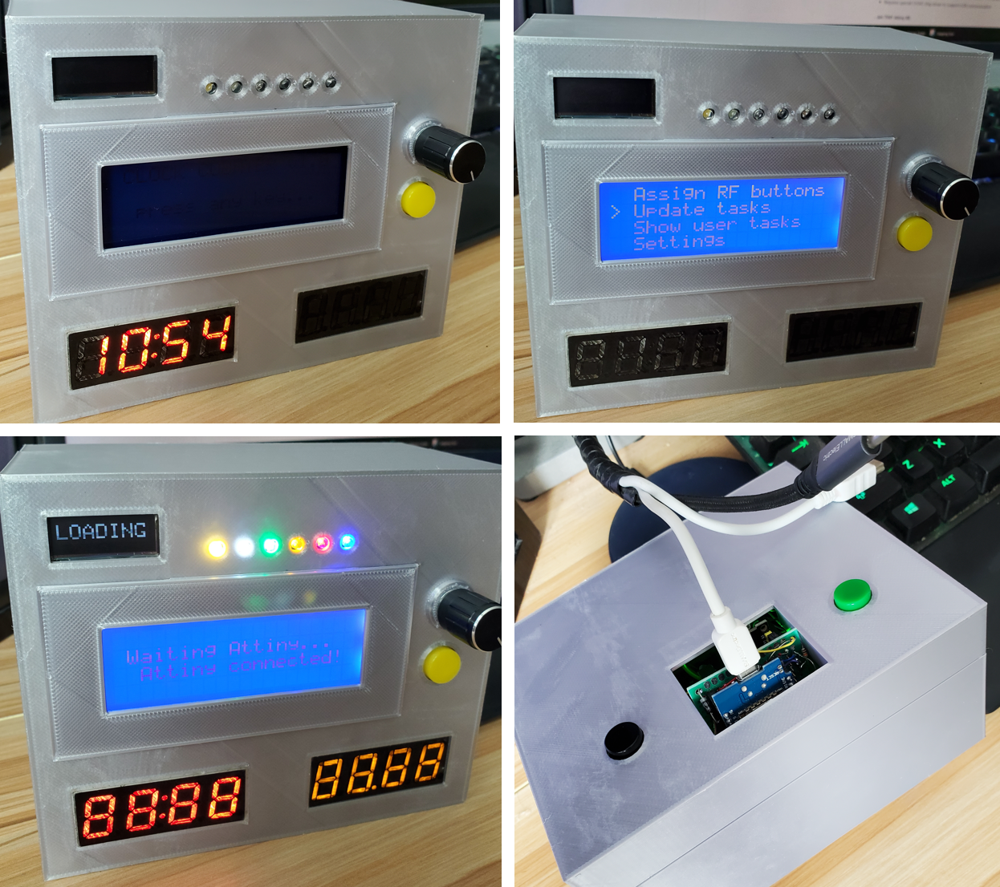
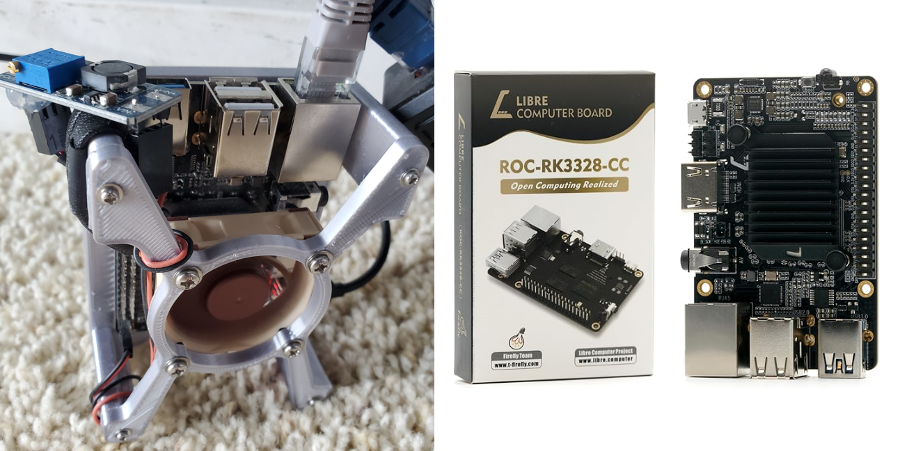
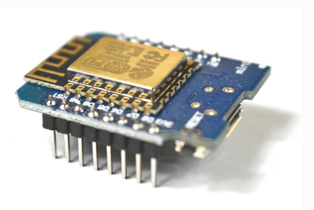
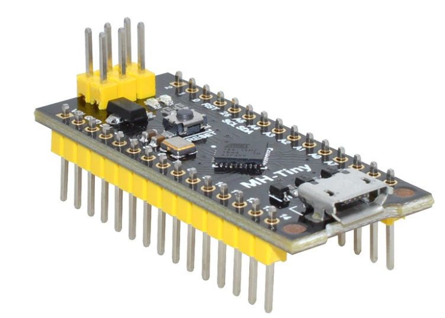
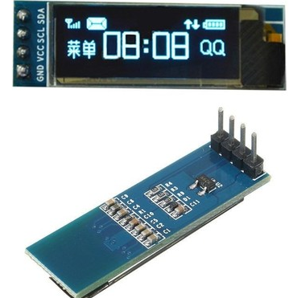
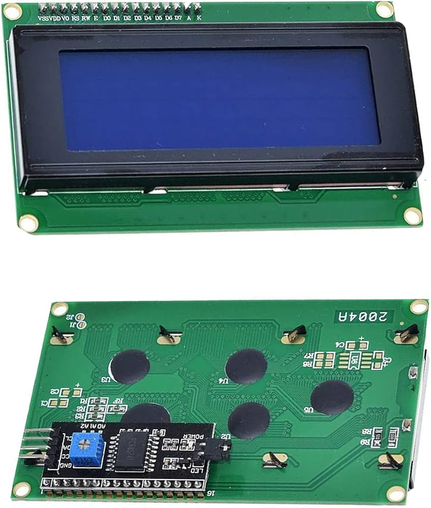
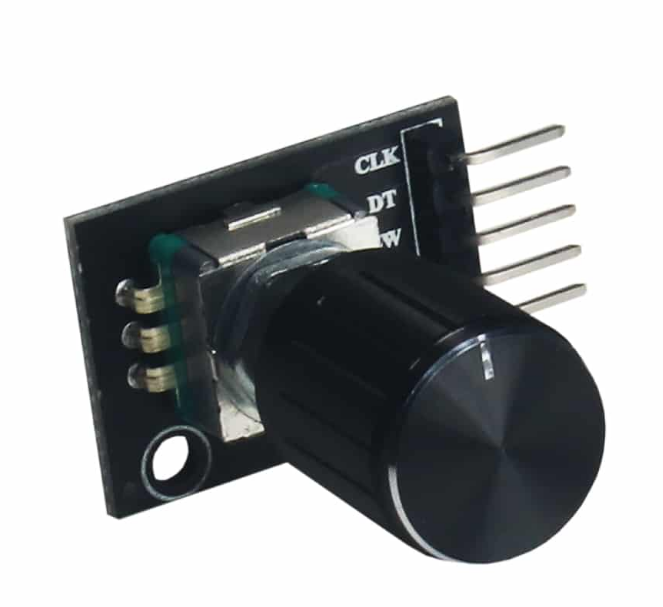
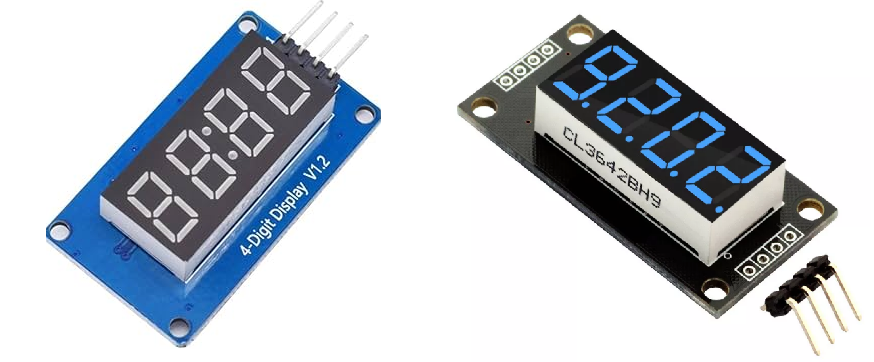
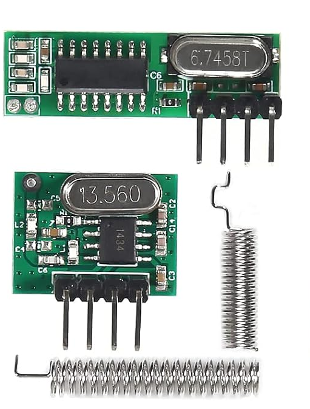

# ClockBoxCounter
'Arduino' based device which helps kids track scheduled tasks and chores progresses.

This device designed with 2 independent controllers in mind. Main controller (Wemos board) does Wi-Fi connections to maintain web-server API interactions and processes user actions.
Secondary controller (Attiny board) does async LED blinking, buzz sounds and reads some button inputs, without stuttering main board.

## Web Service:
 - Small LAN web-server @'Raspberry Pi'-like computer (Libre Computer Renegade), running Debian with Python-Dash (Flask) service and SQLite DB for containing existing user Tasks/Chores progresses and providing simple API interface for adding/updating users tasks.

## Used Electrical Parts:

### A) Controller Boards:

#### - Wemos D1 mini.

Used as Master Controller. Interacts with web-server and controls user interface.

**Pros**

* Has integrated Esp8266 onboard to connect to Wi-Fi
* Interrupts on each digital pin
* Large sketch/variable memory
* Quick reboot time

**Cons**

* Small pins amount
* ESP architecture can't propely communicate with Attiny via I2C
* Analog pin can be used only as input
* Can't properly load and flash sketches if D8 pin is pulled-up
* Long compiling and flashing time, comparing to Attiny (up to 1 minute vs 10 secs)
* Randomly blocks virtual COM port after several flashes until PC is rebooted
* Requires special CH341 chip driver to support USB communication
  
#### - AH-TINY Attiny 88.

Used as Slave Controller. Controls music and independent LEDs blinking.

**Pros**

* Very cheap alternative to Arduino
* Plenty of digital and analog PINs. Supports I2C

**Cons**

* **EXTREMELY** ! small RAM size for sketch and variables, which makes programming of many options very tricky
* Doesn't have hardware serial support, which makes it almost impossible to debug
* If variables use more than 96% of memory, became unstable
* For some reason can't communicate with ESP via I2C
* Long time to boot after reset (up to 8 seconds)

### B) Arduino components:

#### SSD1306 I2C OLED Display

Used for short pop-up messages and progress bar visualisation.

#### 2004A I2C LCD 20 x 4 rows LCD Display

Used for user menu and displaying text messages.

#### KY-040 Encoder

Used for user iteraction with menu interface.

#### TM1637 4-digit 7-Segment LED Display (1x Clock-Type, 1x Decimal point type)

Used for displaying clock in stand-by mode, and selected task progress in user-interaction mode.

#### RF 433 MHz Transmitter / Receiver modules

Used for programming and reading pressed buttons of user remotes (for individual tasks display for each user).

#### User Remotes

Programmable 433MHz remote used as individual console to interact with ClockBoxCounter.

#### Various small parts for Arduino

Push-up buttons, ultra-bright 3mm LEDs, breadboard, electronic components (diodes, resistors, capacitors, mosfet) for wiring circuit.

## Inner Wiring Scheme:

## Project progress:

### - Hardware progress

#### - Electronic
- [x] Schematic design
- [x] Components prototyping
- [x] Soldering circuit

#### - Hull Design
- [x] 3D model prototype fitting
- [x] Create case STL 3D model
- [ ] Add images with user-friendly wiring scheme **TODO**

### - Software progress

#### - Attiny
- [x] Implement music (via buzzer)

  * Due to limited Attiny memory, async music play produced various crashes, hangs and memory overflows. Eventually I did it completely synchronous, which means that Attiny cannot blink or read pin signals until current melody is completed. Thus all melodies made as short as possible.
    
- [x] Implement LED blinking schemes
  - [x] Police blinking
  - [x] Individual LED blinking
- [x] Implement interactions with Master board
  
  * I hadn't been able to make I2C interation between Wemos and Attiny work (though, Wemos-Arduino Nano worked perfectly). Eventually, I changed I2C to Serial communication via SoftwareSerial on Attiny part (which severely limited available memory on Attiny board). Due to many componnents used in the circuit, UART communication may suffer from inducted noise. To mitigate that issue I experimented with baud rates and read delays and eventually implemented simple command checksum verification for communication protocol.
    
  - [x] Implement checksum verification to ensure proper command execution
- [x] Read push buttons and send signals to Master board

#### - Wemos
- [x] Implement Standby mode
- [x] Add Wi-Fi connection for internet and intranet data updates
- [x] Show clock in Standby mode
  - [x] Add clock sync with internet UTC service
- [x] Implement Attiny serial communication
  - [x] Add Attiny ping function to ensure that Slave board is online
- [ ] Add user menu interface **IN PROGRESS**
  - [x] Add placeholder screen for Standby mode (when backlight is off)
  - [x] Add menu interruption and resuming functions to show temporary messages
  - [ ] Create Demo in Settings menu  **TODO**
- [x] Add LCD display text printing routine
- [x] Add OLED display text printing routine
  - [x] Add auto closing pop-up messages
  - [x] Add progress bar for long running processes  
- [ ] Add user tasks dowloading via web-server API **IN PROGRESS**
   - [x] Add new tasks counter indicator in Standby mode
   - [x] Add task signals manifestatation (blinking/sounds) in Standby mode
   - [ ] Add new tasks download from Web-server API **TODO**
- [ ] Implement RF 433 MHz protocol communication **IN PROGRESS**
  - [x] Add RF reading for detecting users and distinguish remote buttons pressed
  - [x] Add generating and transmitting RF signal for choosen user via Menu for remote programming
  - [ ] Add interaction with downloaded tasks via RF remote **TODO**

#### - LAN web server API
- [ ] Add Web-Server API for individual user tasks **TODO**
  - [ ] Add tasks create/update interface for individual users **TODO**
